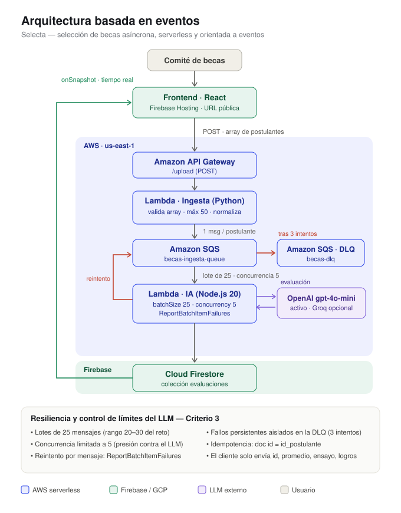
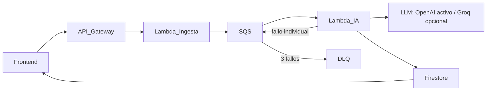

# Selecta - selección de becas con IA resiliente

Plataforma para apoyar a un comité de becas en la revisión inicial de
postulaciones. Procesa lotes de expedientes mediante una arquitectura
asíncrona basada en eventos y muestra los resultados en tiempo real.

**Frontend público:** https://hackaton-2fcba.web.app

## Problema e impacto

La solución reduce la carga de lectura inicial, prioriza expedientes que
requieren revisión humana y conserva la decisión final en manos del comité.
Lee el documento completo en [docs/CONTEXTO.md](docs/CONTEXTO.md).

## Arquitectura



Versión resumida en texto:



El detalle, controles de resiliencia y configuración están en
[docs/ARQUITECTURA.md](docs/ARQUITECTURA.md).

## Estructura

```text
frontend/              React + TypeScript + Firebase Hosting
backend/
  ingesta/             Lambda Python: API Gateway -> SQS
  ia/                  Lambda Node.js: SQS -> LLM -> Firestore
docs/                  Contexto, arquitectura y evidencia de demo
MANUAL_DESPLIEGUE.md   Guía integral de despliegue
```

## Flujo de demostración

1. Cargar [test-becas-30.csv](frontend/public/test-becas-30.csv) desde el
   frontend.
2. El frontend envía el lote a API Gateway.
3. La Lambda de ingesta normaliza el contrato y envía un mensaje por
   postulación a SQS.
4. La Lambda IA consume lotes de 25, evalúa cada postulación mediante el LLM
   configurado (OpenAI en la configuración actual; Groq es alternativa compatible) y
   persiste resultados validados en Firestore.
5. Ante un 429, solo los mensajes fallidos se reintentan; los persistentes se
   conservan en la DLQ.
6. Firestore actualiza el tablero en tiempo real; el comité revisa y exporta
   resultados.

## Pruebas locales

### Lambda de ingesta

```powershell
python -m unittest discover -s backend/ingesta/tests -v
```

### Lambda de IA

```powershell
cd backend/ia
npm install
npm test
```

Con una clave LLM válida, la prueba integrada se ejecuta con:

```powershell
npm run test:local
```

## Despliegue

Consulta [MANUAL_DESPLIEGUE.md](MANUAL_DESPLIEGUE.md) y
[backend/ia/MANUAL_ROL3.md](backend/ia/MANUAL_ROL3.md). Nunca subir claves de
del proveedor LLM, archivos `.env` ni credenciales de Firebase.

## Evidencias de la demostración

Las capturas y el video de la demostración están enlazados en
[docs/EVIDENCIAS_DEMO.md](docs/EVIDENCIAS_DEMO.md).
