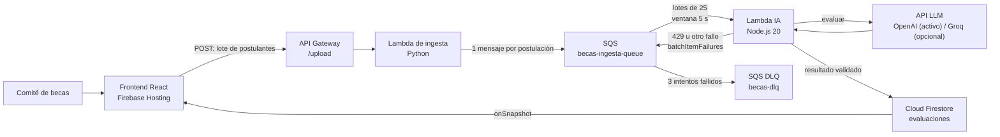

# Arquitectura basada en eventos

## Controles de resiliencia

| Control | Implementación |
|---|---|
| Procesamiento masivo | Event source mapping SQS con `batchSize: 25`. |
| Presión contra LLM | `reservedConcurrency: 5` y `maximumConcurrency: 5`. |
| Rate limit | El cliente LLM distingue HTTP 429 y el handler devuelve fallos individuales. |
| Reintentos | `ReportBatchItemFailures`; SQS reintenta solo el mensaje fallido. |
| Aislamiento | La DLQ conserva mensajes que exceden `maxReceiveCount: 3`. |
| Idempotencia | Firestore actualiza el documento del mismo postulante en vez de duplicarlo. |
